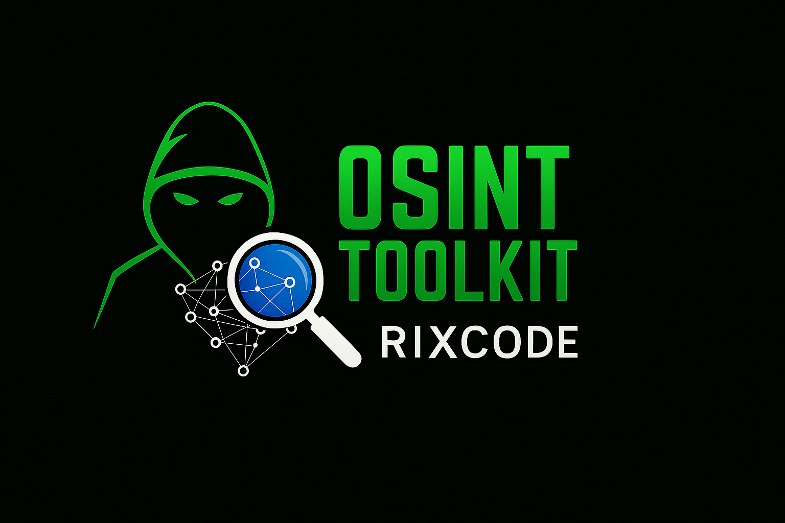

# OSINT_toolkit
(Open-Source Intelligence)
You can Find Any-One by Just email, phone number, username, etc
# 🕵️ Simple OSINT Tool
<p align="center">
  
</p>
This powerful and easy-to-use Python script automates the initial steps of open-source intelligence (OSINT), helping you quickly gather public information on usernames, email addresses, and phone numbers.

<p align="center">
  
  
  
</p>

---

## 🚀 Features

✅ **Username Search** → Uses the powerful [Sherlock](https://github.com/sherlock-project/sherlock) library to find a user’s presence across 400+ social media websites.  
✅ **Phone Number Analysis** → Detects country, carrier, and type (mobile/fixed-line) using the [phonenumbers](https://github.com/daviddrysdale/python-phonenumbers) library.  
✅ **Structured Reporting** → Generates a clean, readable **Markdown report (`README.md`)** with all findings.  

---

## 🖥️ Demonstration

A quick demonstration of the tool in action.  
*(Example output with Sherlock + Phone Number check)*  

<p align="center">
  
</p>

---

## ⚙️ Installation

### 📋 Prerequisites
- Python **3.8+**  
- `pip` (Python package installer)  

### 🔧 Step-by-Step Guide

1️⃣ **Clone the Repository**
```bash
git clone https://github.com/your-username/your-repo-name.git
cd your-repo-name

2️⃣ Install Dependencies

# Install the dependencies
pip install -r requirements.txt

# Or install manually
pip install phonenumbers requests beautifulsoup4

3️⃣ Install Sherlock (required separately)

# Recommended way: via pipx
pip install pipx
pipx install sherlock-project

# Or direct install
pip install sherlock-project

💻 Usage

Run the script:

python3 main.py

The tool will prompt you for input:

    Username → your-username-here

    Phone Number → +15551234567 (with country code)

    Email Address → your.email@example.com

    IGNOU Roll Number → (optional, type null if not available)

After execution, a report (README.md) will be generated with all findings.
📄 Example Report (Auto-Generated)

# OSINT Report for john_doe

**Date of Report:** 2025-08-26

---

## Social Media and Username Findings
```csv
site,username,url,exists
Twitter,john_doe,https://twitter.com/john_doe,True
Instagram,john_doe,https://instagram.com/john_doe,True
...

Website & Other Findings

IGNOU Website Search: No roll number provided.
Phone Number Analysis

    Full Number: +15551234567

    Country: United States

    Service Provider: AT&T

    Is Mobile: Yes


---

## ⚠️ Disclaimer

> This tool is intended for **educational and ethical purposes only**.  
> The information gathered is **publicly available** on the internet.  
> Use this tool **responsibly** and always respect privacy laws and terms of service.  

**Do not** use this tool for illegal or malicious activities.  

---

## 🙏 Contributing

Contributions are always welcome! 🎉  

1. Fork the repository  
2. Create a new branch → `git checkout -b feature/new-feature`  
3. Make your changes → `git commit -m "Add new feature"`  
4. Push → `git push origin feature/new-feature`  
5. Open a Pull Request 🚀  

---

<p align="center">Made with ❤️ by OSINT enthusiasts 🕵️</p>
